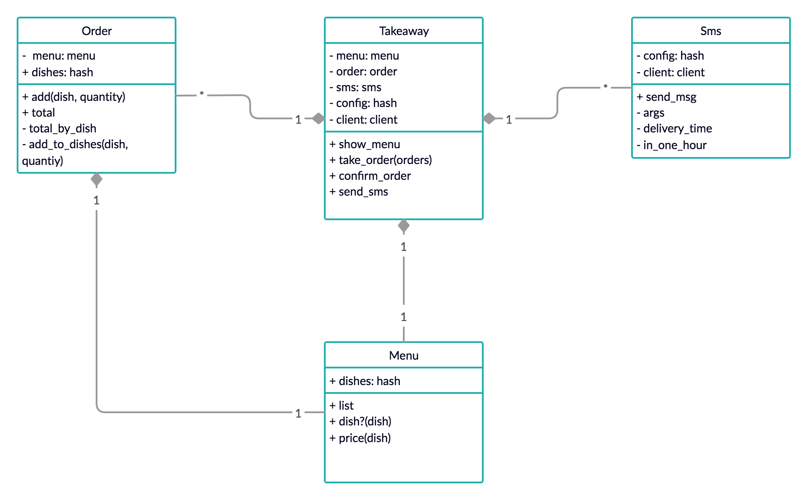

# Takeaway


## Table of Contents
* [Code Quality](#code-quality)
* [Technologies](#technologies)
* [Getting Started](#getting-started)
* [Testing](#testing)
* [Domain Model](#domain-model)
* [Principles and takeaways](#principles-and-takeaways)
* [Analysis](#analysis)
* [Author](#author)

## Code Quality
[](https://codeclimate.com/github/xelAhcratiPsavilO/takeaway/maintainability)

## Technologies
- Main technology
  - [Ruby](https://www.ruby-lang.org/en/) - High-level, general-purpose language utilized as main technology.
- Unit Test
  - [RSpec](https://rspec.info/) - Domain specific language utilized as testing tool.
- Feature Test
  - [IRB](https://en.wikipedia.org/wiki/Interactive_Ruby_Shell) - Interactive ruby shell utilized as a REPL.
- Documentation
  - [MD](https://www.markdownguide.org/) - Lightweight markup language utilized for documentation.

## Getting Started

Follow the instructions below to clone the repository and run it locally for testing and development demonstrations.

### Prerequisites
- Verify that a current version of Ruby is installed:
```bash
ruby -v
```

### Installing
- Clone the repository:
```bash
git clone git@github.com:xelAhcratiPsavilO/takeaway.git
```
- Install dependencies listed in the Gemfile:
```bash
bundle install
```
- Launch irb, pry or other ruby REPL:
```bash
irb
```
- Launch system script (Twilio verified number required):
```
ruby system_script.rb
```
### Running
- Load the Takeaway class (similarly for any other class):
```bash
> require './lib/takeaway'
=> true
```
- Create a new Menu instance (similarly for any other class):
```bash
> menu = Menu.new
=> #<Menu:0x00007f8aee176d50>
```

### Testing
- Launch RSpec to verify that all tests are passing:
```bash
rspec
```
- Expected output:
```bash
....
Finished in 0.01715 seconds (files took 0.11363 seconds to load)
16 examples, 0 failures
```

## Domain Model

High-level overview of the entities that make up this functional system.



Based on [client's requirements](USER_STORIES.md).

Objects-Messages [diagram](DIAGRAM.md).

## Principles and takeaways
A scalable design and seamless integration allowed the extraction and encapsulation of responsibilities into several classes.
Abstraction and privatization of methods and properties allows to hide complexity creating simpler interfaces and reducing the impact of change.
Dependency injection looses the coupling between objects, making the system more flexible, scalable and testable in isolated units.
Forwarding methods allows to encapsulate behavior in new objects maintaining code in line with the single responsibility principle.

## Analysis
There is room for improvement around abstraction and encapsulation to reduce the high number of instance variables.
At the moment the system has a one on one relation of composition between Takeaway class and Menu class, it could be interesting considering that a Takeaway class could have several menus to choose from.
It would have been interesting extracting the dish functionality into a Dish class.
Currently the script shows a small portion of the system, it would have been worth expanding on the script to showcase all the functionality of the system.
It would have been worth using memoization to make sure that instance variables in a method only get set once.

## Author

Alejandro Pitarch Olivas
